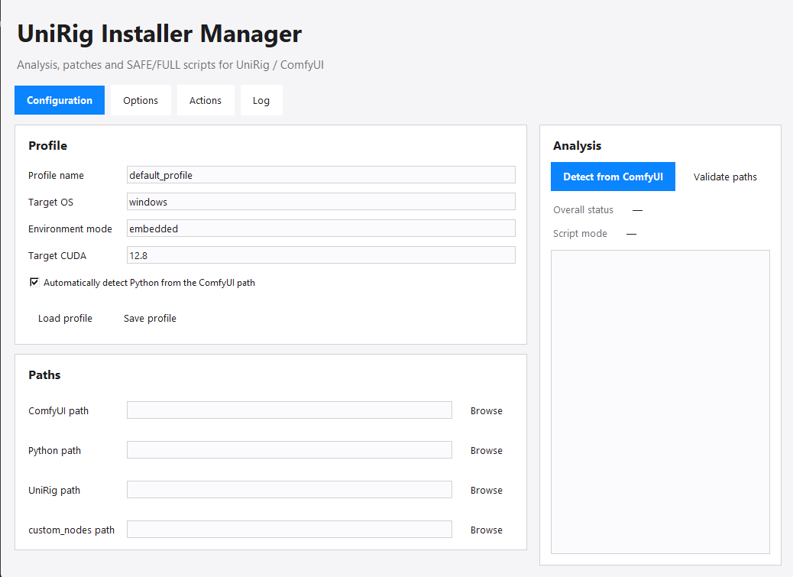

# UniRig Installer V1


Automatically install UniRig in ComfyUI — rig your 3D characters in seconds.



---

## 🌍 Languages

English | [Français](README_FR.md) | [中文](README_CN.md)

---

## ⚠️ Important

After installing UniRig, **DO NOT restart ComfyUI**.

You must **fully CLOSE ComfyUI** before running UniRig Installer.

❌ Do NOT restart ComfyUI
✅ Fully CLOSE ComfyUI

Restarting ComfyUI may create an incorrect environment.

---

## ⚠️ If UniRig was already installed

An outdated environment may exist and cause issues.

The easiest and safest way to fix this is:

1. Open ComfyUI
2. Open **ComfyUI-Env-Manager** by clicking the **ENV** button at the top of the interface
3. Delete any existing UniRig environment
4. Close ComfyUI completely

Then run UniRig Installer.

---

## 🚀 Installation Guide

### Step 1 — Install UniRig in ComfyUI

* Open ComfyUI
* Install **UniRig** via ComfyUI Manager

👉 Then **close ComfyUI completely**

---

### Step 2 — Run UniRig Installer

Launch the app and click in order:

1. Detect
2. Update comfy-env
3. Generate Script
4. Export Script

---

### Step 3 — Run the script

Open PowerShell and run:

```powershell
.\SCRIPT_UNIRIG.ps1
```

---

### Step 4 — Launch ComfyUI

* Start ComfyUI
* Load your UniRig workflow
* Run

---

## 💡 Notes

* The installer prepares the correct environment automatically
* On some very recent GPUs, dependency installation may vary
* If needed, follow on-screen instructions

---

## ❤️ Contribution

Feedback and suggestions are welcome!

---

## 🚀 Download

Download the latest version from the **Releases** section of the GitHub repository.

---

## 👤 Author

Project initiated and developed by **emilune**  
GitHub: https://github.com/emilune  

With the help of ChatGPT for technical problem-solving and automation.

---

## 🙏 Acknowledgements

- ComfyUI community  
- UniRig developers  
- Open-source ecosystem 
