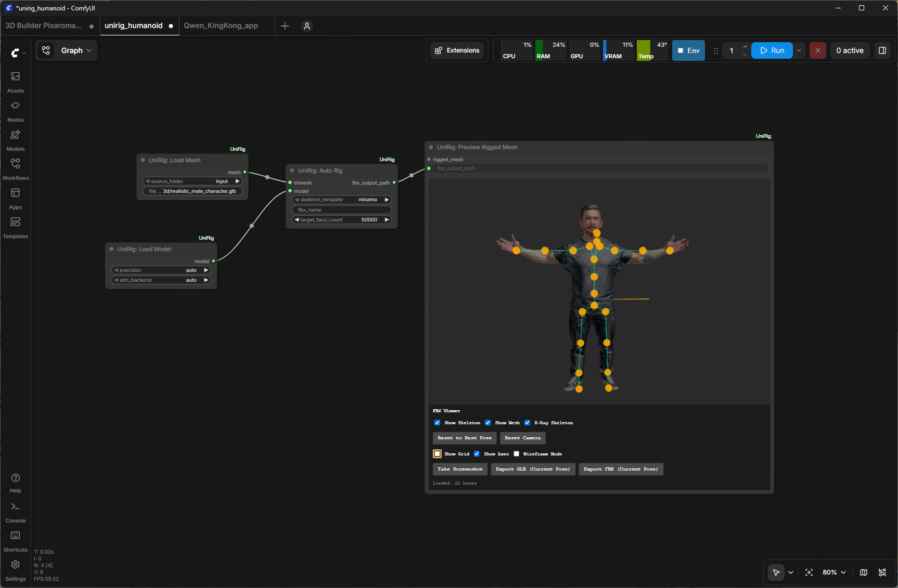
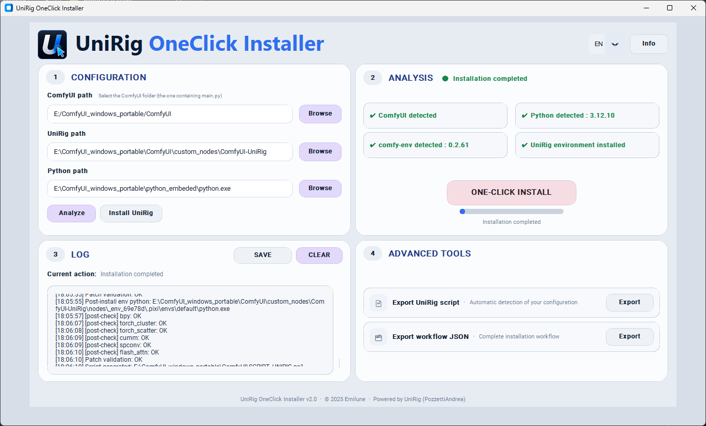

# 🚀 UniRig OneClick Installer

Install, configure and activate **UniRig in ComfyUI — in one click.**

---

## ⬇ Download

👉 **[Download Latest Version (.exe)](https://github.com/emilune/unirig-installer/releases)**

---

🌍 **Languages**  
[🇬🇧 English](README.md) | [🇫🇷 Français](README_FR.md) | [🇨🇳 中文](README_CN.md)

---

## 🎬 Result Preview

---

## ⚡ One-Click Experience

No manual setup. No configuration. No troubleshooting.

👉 Just follow:

**INSTALL UNIRIG → ONE-CLICK INSTALL → OPEN COMFYUI → RUN YOUR WORKFLOW**

---

## 🧠 What it does

This tool automatically:

- Detects your ComfyUI environment
- Installs UniRig
- Creates a clean isolated environment (comfy-env)
- Installs all required components
- Applies all necessary fixes and patches

👉 **Result: UniRig works instantly in ComfyUI**

---

## 🖥️ Interface Preview

---

## 🚀 Usage  
*(Recommended: Microsoft Edge, Firefox, or Opera)*

### 1. Select your ComfyUI folder
Click **"Browse"** next to the ComfyUI path field and select your ComfyUI folder.

### 2. Run Analyze
Click **"Analyze"**.

The app will automatically detect the Python path and UniRig status when possible.

### 3. Install UniRig
Click **"Install UniRig"**.

### 4. Run ONE-CLICK INSTALL
Click **"ONE-CLICK INSTALL"**.

### 5. Open ComfyUI
Launch ComfyUI as administrator.

### 6. Run your workflow
Load a UniRig workflow and run it.

👉 Done.

---

## 🟢 Expected Result

- UniRig fully operational  
- No missing modules  
- No environment issues  
- Workflows run successfully  

---

## 🔍 Compatibility

- ComfyUI (Desktop / Local / Portable)
- Python 3.12
- GPU (CUDA supported)

---

## 🧪 Tested Environments

Tested across multiple ComfyUI setups:

- Desktop (venv)
- Windows Portable (embedded)
- Easy Install (embedded)
- Local installation

---

## ❤️ Credits

- ComfyUI community  
- UniRig by PozzettiAndrea  
- Open-source ecosystem  

---

## 👤 Author

**emilune**  
https://github.com/emilune
